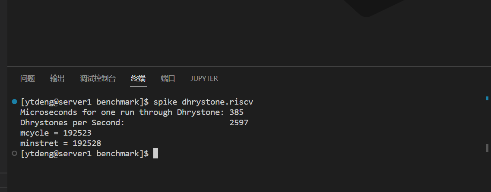
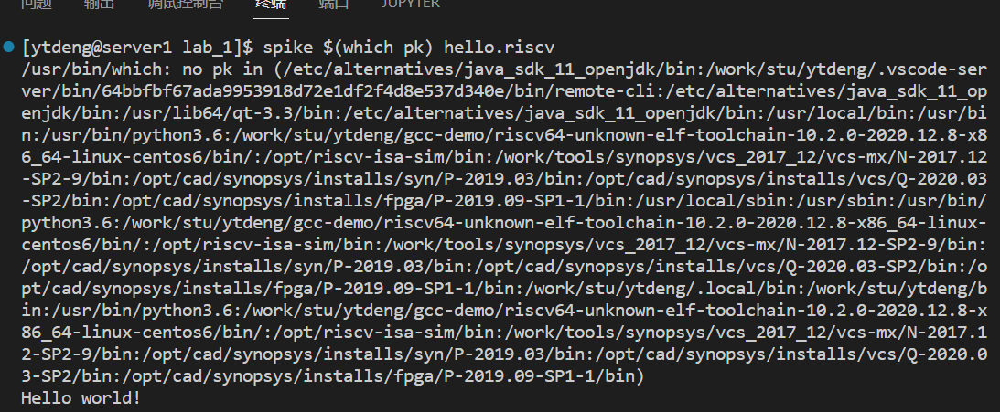
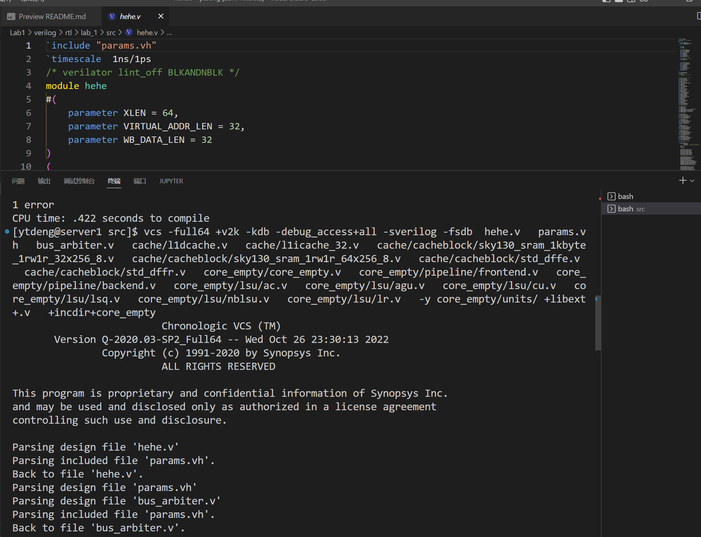
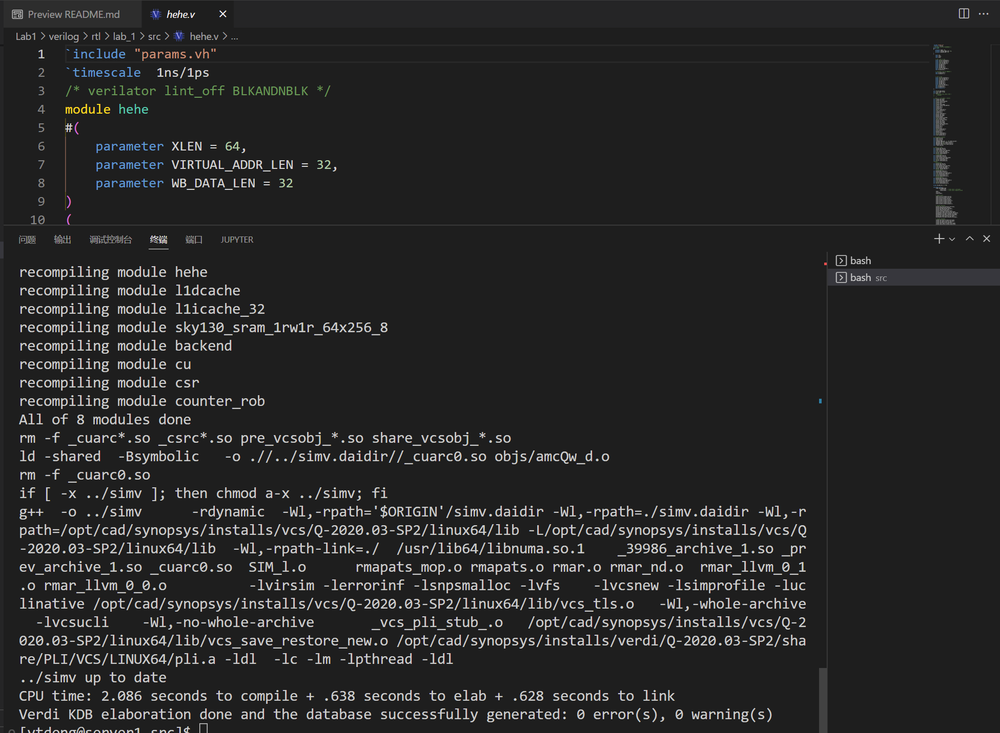
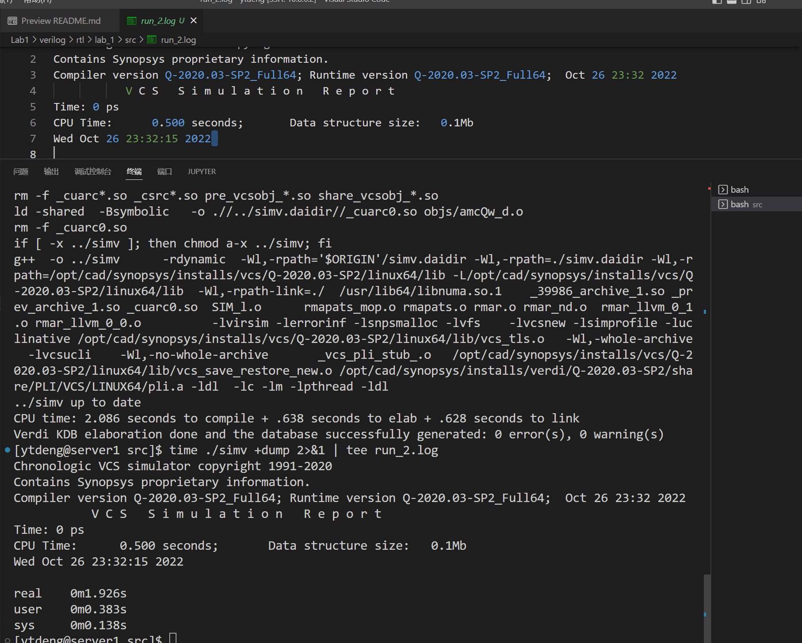
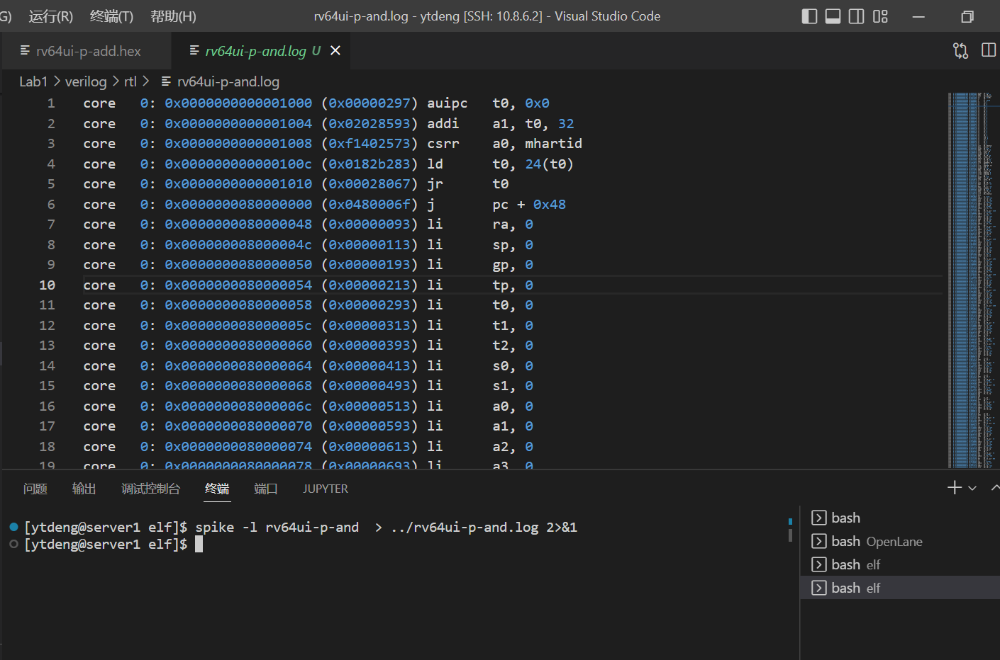
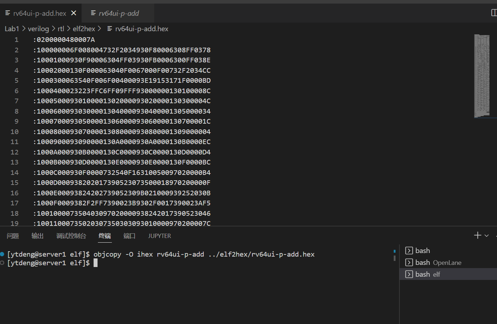
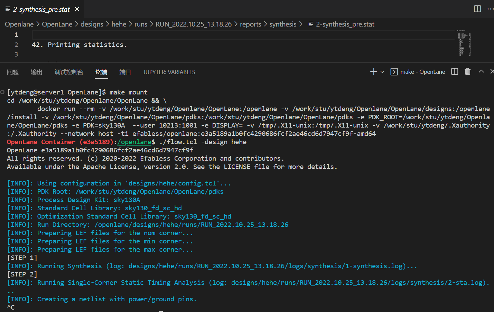

# Lab1
## Spike model and co-sim
### a. Spike model (with risc-v pk) execution correctness: simulate programs atop the proxy kernel 


### b.GreenRio core RTL execution correctness: pass some ISA tests (Synopsys VCS environment)



### c. Spike model + GreenRio RTL co-simulation system
#### i. You need to run the elf file on the spike emulator and print the log 

#### ii.You need to have GreenRio run the risc-v elf in an RTL simulation environment and get the corresponding results: register states, values, etc.

。。。
## Open EDA flow

1. The first run
```r
# config
set ::env(LIB_SYNTH) "$::env(PDK_ROOT)/$::env(PDK)/libs.ref/$::env(STD_CELL_LIBRARY)/lib/sky130_fd_sc_hd__tt_025C_1v80.lib"
set ::env(LIB_FASTEST) "$::env(PDK_ROOT)/$::env(PDK)/libs.ref/$::env(STD_CELL_LIBRARY)/lib/sky130_fd_sc_hd__ff_n40C_1v95.lib"
set ::env(LIB_SLOWEST) "$::env(PDK_ROOT)/$::env(PDK)/libs.ref/$::env(STD_CELL_LIBRARY)/lib/sky130_fd_sc_hd__ss_100C_1v60.lib"
```
```r
# result
Number of wires:              51865
Number of wire bits:          52044
Number of public wires:        9356
Number of public wire bits:    9535
Number of memories:               0
Number of memory bits:            0
Number of processes:              0
Number of cells:              51971
Chip area for module '\hehe': 561329.609600
```
2. The second run
```r
# config
set ::env(LIB_SYNTH) "$::env(PDK_ROOT)/$::env(PDK)/libs.ref/$::env(STD_CELL_LIBRARY)/lib/sky130_fd_sc_hd__tt_100C_1v80.lib"
set ::env(LIB_FASTEST) "$::env(PDK_ROOT)/$::env(PDK)/libs.ref/$::env(STD_CELL_LIBRARY)/lib/sky130_fd_sc_hd__ff_100C_1v65.lib"
set ::env(LIB_SLOWEST) "$::env(PDK_ROOT)/$::env(PDK)/libs.ref/$::env(STD_CELL_LIBRARY)/lib/sky130_fd_sc_hd__ss_n40C_1v28.lib"
```
```r
# result
Number of wires:              51867
Number of wire bits:          52046
Number of public wires:        9356
Number of public wire bits:    9535
Number of memories:               0
Number of memory bits:            0
Number of processes:              0
Number of cells:              51973
Chip area for module '\hehe': 561338.368000
```