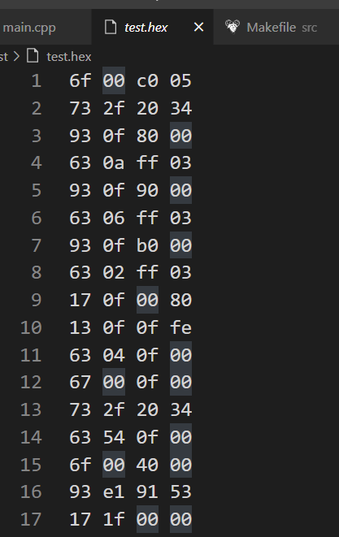
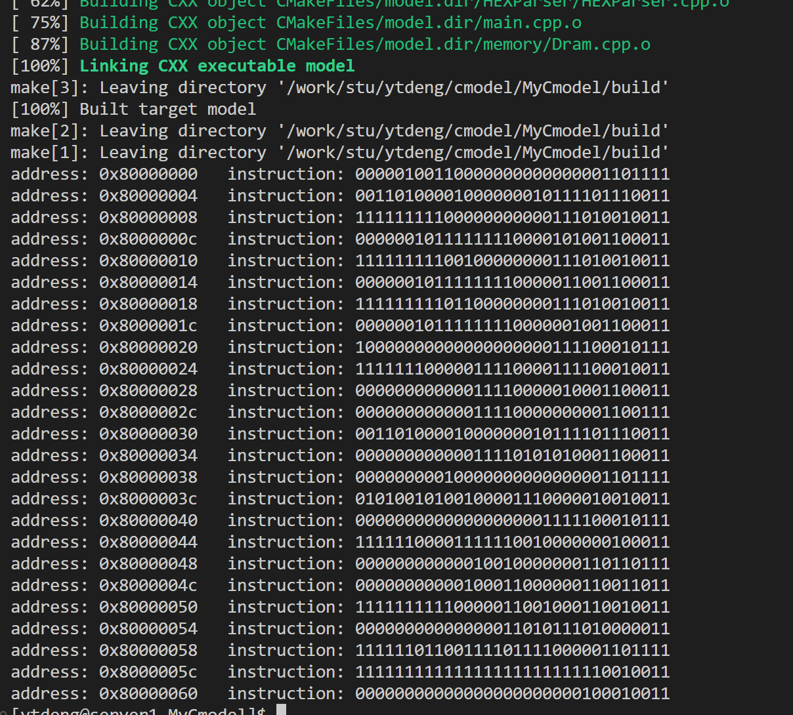
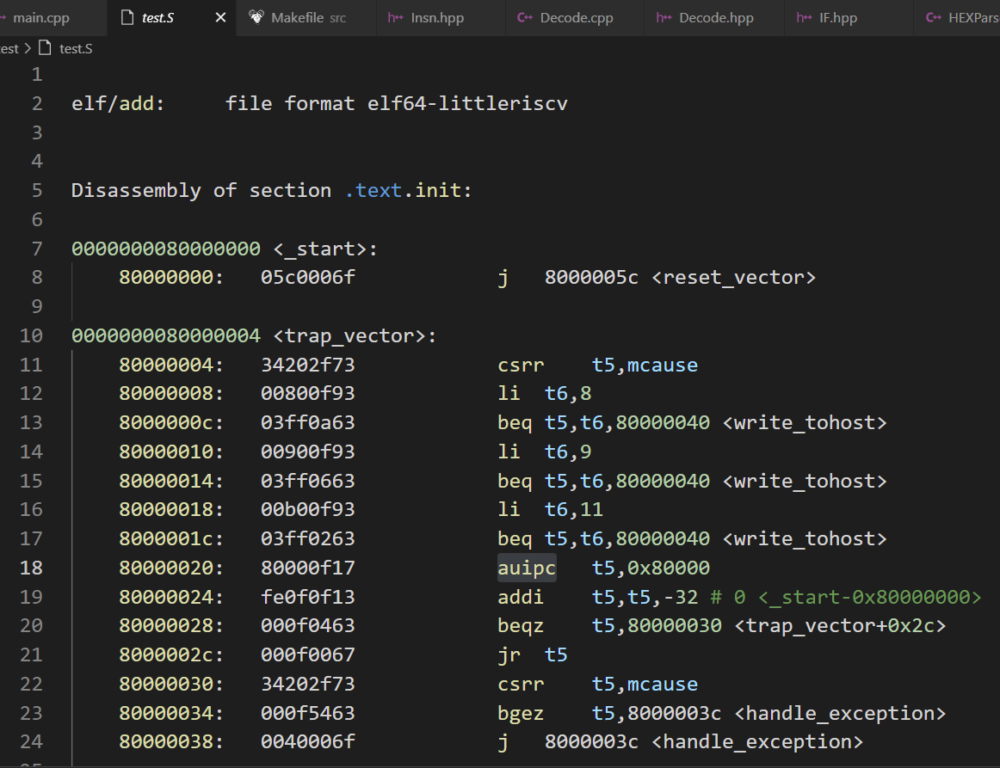
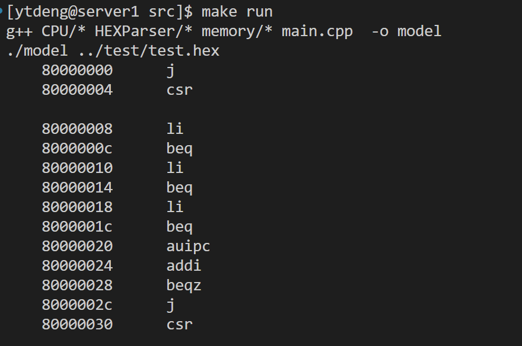
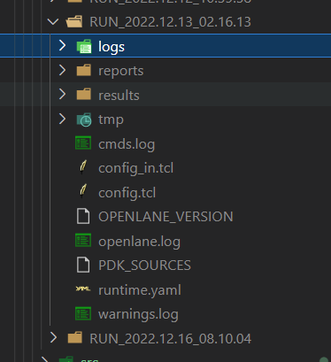

# Lab2
## C model for original GreenRio frontend
code in /cmodel/MyCmodel   
use `make run` command to run cmake to compile all cpp files    
design variables of different parts according to HeHecore.md
### HEXParser
original HEX file     

### Dram
load HEX to the memory  

### Decode
original assembly file   

Decode result   

## Openlane
### floorplan,placement,CTS and global routing
logs,results,reports in /openlane/RUN_2022.12.12_10.39.58/   

