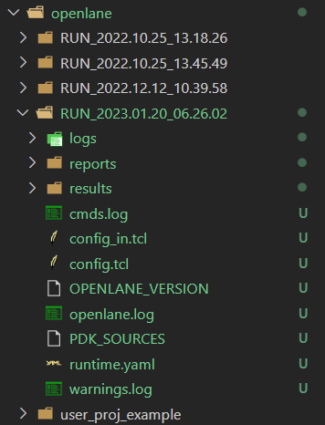

# Lab3
## 1. GreenRio microarchitecture performance improvement 
### a. Finishing your Greenrio performance model (frontend, backend, and uncore part)
 
### b. Searching for original Greenrio performance issues/bugs by comparing against the model, the more the better 
1. Change single-issue to dual-issue
2. Change blocking InstructionCache to non-blocking
3. Use Set-Associative Cache
4. Send multiple instructions to instruction buffer at once
## 2. EDA flow
### a. Greenrio core RTL to GDS flow by openlane
#### Signoff report generation: your flow should pass DRC/LVS check
logs,results,reports in /openlane/RUN_2023.01.20_06.26.02/   



#### i. In the lab report, briefly describe what DRC is; the DRC problems you have encountered (If you have not encountered such a problem, please skip it), and the common solutions

in openlane/RUN_2023.01.20_06.26.02/logs/signoff/33-drc.log

 **Design Rule Checking (DRC)** verifies as to whether a specific design meets the constraints imposed by the process technology to be used for its manufacturing. DRC checking is an essential part of the physical design flow and ensures the design meets manufacturing requirements and will not result in a chip failure. 
#### ii. In the lab report, briefly describe what LVS is; the LVS problems you have encountered (If you have not encountered such a problem, please skip it), and the common solutions.
in openlane/RUN_2023.01.20_06.26.02/logs/signoff/32-lvs.lef.log

**Layout Versus Schematic (LVS)** checking compares the extracted netlist from the layout to the original schematic netlist to determine if they match. The comparison check is considered clean if all the devices and nets of the schematic match the devices and the nets of the layout.

#### iii. Briefly analyze your signoff results in the lab report. If a warning/error still exists, point them out; If all passes, give final report information. 
```
[WARNING ODB-0220] WARNING (LEFPARS-2036): SOURCE statement is obsolete in version 5.6 and later.
The LEF parser will ignore this statement.
To avoid this warning in the future, remove this statement from the LEF file with version 5.6 or later.
```
